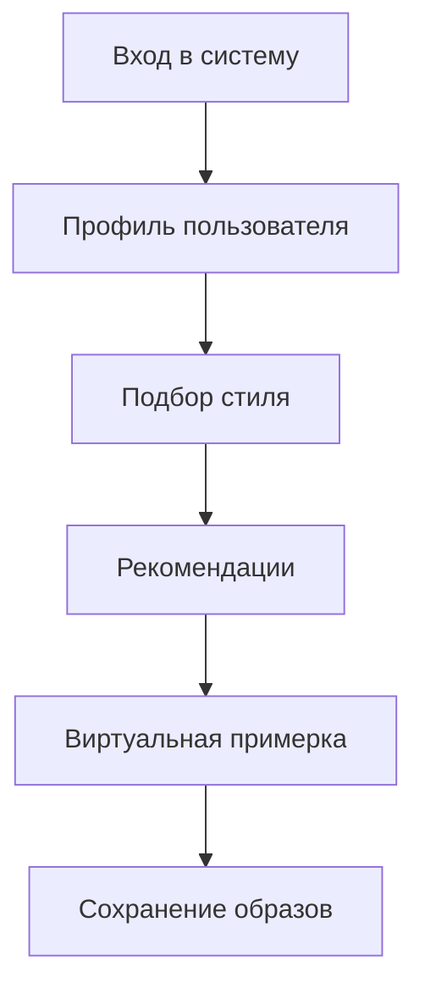
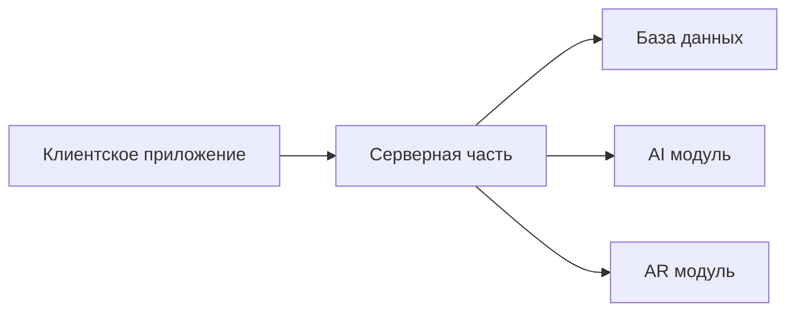

# Подробное описание проекта "Виртуальный стилист для школьников"

## Цели и задачи проекта

### Основные цели
1. Помощь школьникам в развитии уверенности в себе через стиль
2. Обучение основам моды и стиля
3. Создание удобного инструмента для подбора одежды
4. Развитие творческого потенциала учащихся

### Задачи проекта
- Разработка алгоритмов подбора стиля
- Создание образовательных материалов
- Интеграция с существующими школьными системами
- Проведение тестирования в реальных условиях

## Целевая аудитория

### Основные группы пользователей
1. **Школьники**
   - Возраст: 12-17 лет
   - Интересы: мода, стиль, самовыражение
   - Потребности: помощь в выборе одежды, обучение стилю

2. **Родители**
   - Задачи: контроль внешнего вида ребенка
   - Потребности: экономия времени, уверенность в выборе

3. **Школы**
   - Задачи: соблюдение дресс-кода
   - Потребности: создание позитивной атмосферы

## Функциональные возможности

### Основной функционал

### Дополнительные функции
- Календарь сезонных трендов
- Социальные функции (обмен образами)
- Образовательные материалы
- Генератор идей для образов

## Техническая реализация

### Используемые технологии
| Технология | Назначение |
|------------|------------|
| Искусственный интеллект | Анализ стиля и предпочтений |
| Дополненная реальность | Виртуальная примерка |
| Мобильные технологии | Доступность и удобство |

### Архитектура системы

## Этапы реализации

### Этап 1: Подготовительный (Январь 2024)
- [x] Анализ рынка
- [x] Определение требований
- [x] Формирование команды

### Этап 2: Разработка (Февраль-Март 2024)
- [x] Создание прототипа
- [ ] Разработка основных модулей
- [ ] Тестирование функционала

### Этап 3: Внедрение (Апрель-Май 2024)
- [ ] Пробное внедрение
- [ ] Сбор обратной связи
- [ ] Доработка системы

## Ожидаемые результаты

### Количественные показатели
- Охват: 1000+ пользователей
- Точность рекомендаций: 85%+
- Время подбора образа: < 2 минут

### Качественные показатели
- Повышение уверенности пользователей
- Улучшение атмосферы в школах
- Развитие творческого потенциала

## Риски и пути их минимизации

### Основные риски
1. **Технические сложности**
   - Путь решения: привлечение экспертов
   - Мера: регулярное тестирование

2. **Низкая вовлеченность**
   - Путь решения: геймификация
   - Мера: мотивационные программы

3. **Конкуренция**
   - Путь решения: уникальные функции
   - Мера: постоянное развитие

## Бюджет проекта

### Основные статьи расходов
| Статья | Сумма (руб.) |
|--------|--------------|
| Разработка | 500 000 |
| Маркетинг | 200 000 |
| Обучение | 100 000 |
| Итого | 800 000 |

## Дальнейшее развитие

### Планы на будущее
1. Расширение функционала
2. Интеграция с другими платформами
3. Развитие образовательного компонента
4. Выход на международный рынок 